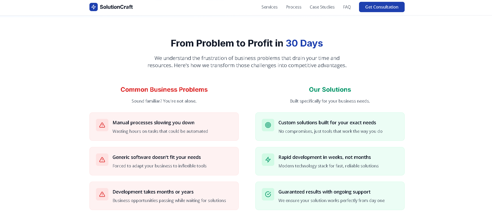
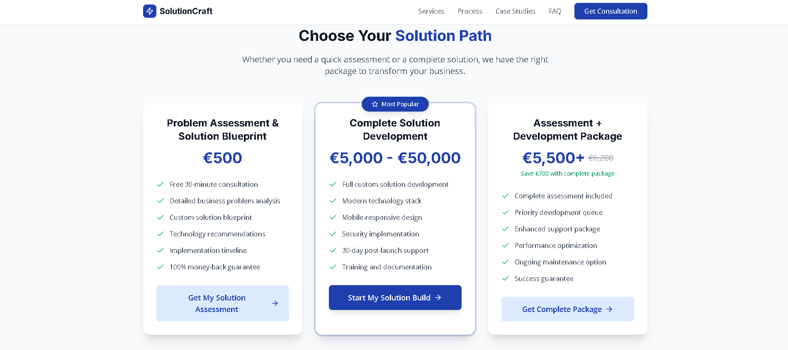
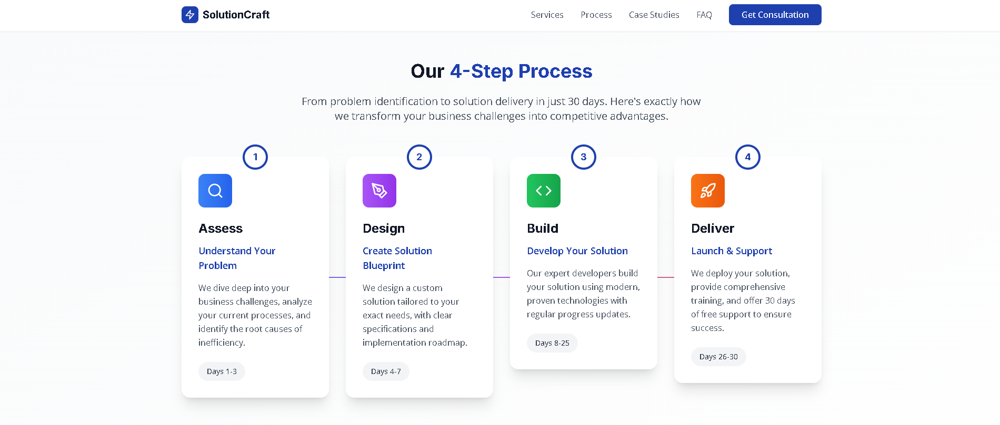
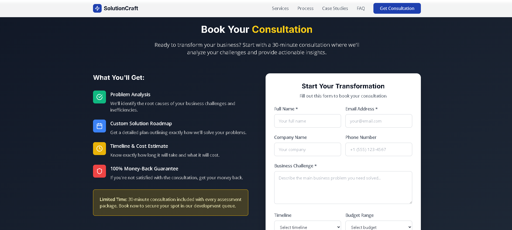

<div align="center">

# Enterprise Solution-Architecture Platform

**An enterprise solution-architecture platform: marketing site, client portal, and team dashboard**

[](https://vitejs.dev)
[](https://react.dev)
[](https://www.typescriptlang.org)
[](https://tailwindcss.com)
[]()

*A public-facing site, an authenticated client portal, and an internal team dashboard - in one platform.*

</div>

> **Available for development and custom work.** This is a working prototype / showcase. I can build and deliver the complete product - including the private production backend - or adapt it for your needs, under a development agreement (post-agreement fee). **Get in touch:** https://github.com/plinkdev1


---

## What Is This?

SolutionCraft is an enterprise solution-architecture platform that combines three surfaces: a public marketing site, an authenticated client portal, and an internal team dashboard for managing projects and architecture deliverables.

> **Market it. Onboard clients. Run delivery.**

---

## Features

| Feature | Description | Status |
|---|---|:---:|
| Marketing site | Public product and marketing pages | ✅ |
| Client portal | Authenticated client area | ✅ |
| Team dashboard | Internal projects and architecture | ✅ |
| Auth + data | Supabase-backed accounts and content | 🚧 |
| Solution builder | Structured architecture deliverables | 🚧 |

---

## How It Works

```
Public marketing site
        │
        ▼
Client portal ◀──▶ Supabase (auth · data)
        │
        ▼
Team dashboard (projects · solution architecture)
```

---

## Tech Stack

| Layer | Technology |
|-------|------------|
| Frontend | Vite, React, TypeScript |
| Styling | Tailwind CSS, Framer Motion |
| Auth / Data | Supabase |

---

## Project Structure

```
solutioncraft/
.bolt/
   config.json
   prompt
src/
   components/
   data/
   types/
   App.tsx
   index.css
   main.tsx
.gitignore
eslint.config.js
index.html
package.json
package-lock.json
postcss.config.js
README.md
tailwind.config.js
tsconfig.app.json
tsconfig.json
tsconfig.node.json
vite.config.ts
vite.config.ts.timestamp-1759136805209-4972218b75d5d8.mjs
```

---

## Screenshots

<p align="center">
  
  
  
  
</p>

---

## Getting Started

```bash
npm install
npm run dev -- --port 5180
```

Environment variables (names only - never commit real values):

```
VITE_SUPABASE_URL=
VITE_SUPABASE_ANON_KEY=
```

---

## Roadmap

- Full client onboarding flow
- Solution-architecture builder
- Role-based dashboard permissions

---

## Notes

Shared as a portfolio artifact demonstrating product and system design. Early prototype, not a finished product.

<div align="center">

MIT

</div>
